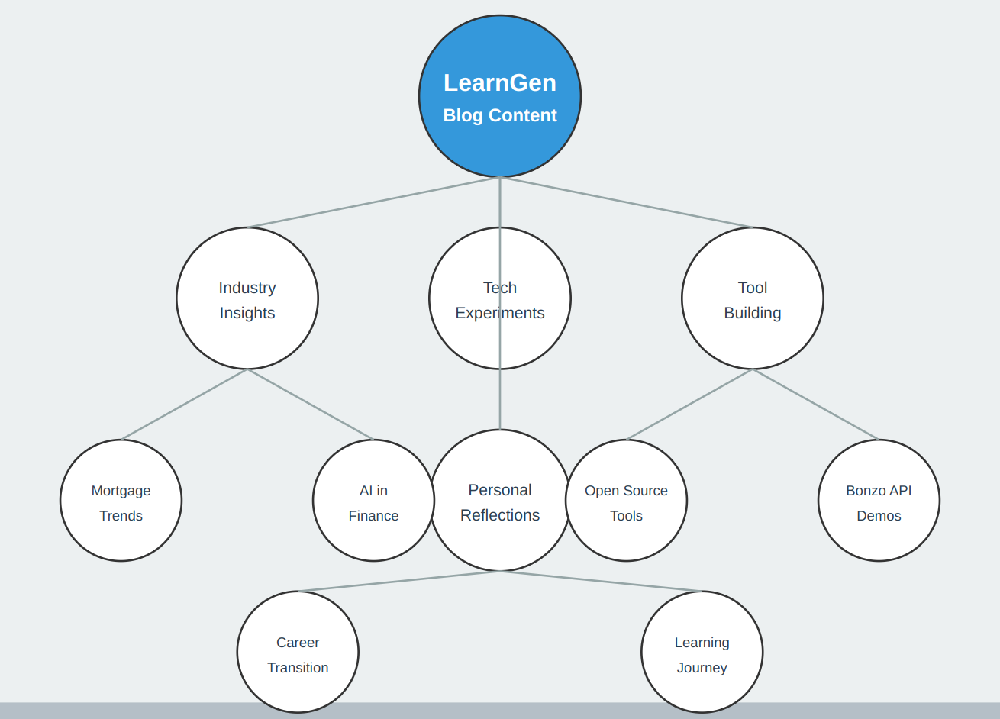

# Welcome!

## How I got Here

Hello, I'm **Ian Melchor**. This blog is my digital space for exploring the fascinating intersections and perspectives around::

| Industry           | Technology            | Skills                |
|--------------------|-----------------------|-----------------------|
| Mortgage Lending   | Artificial Intelligence | Sales                 |
| Finance            | Machine Learning      | System Design         |
| Real Estate        | Open Source Software  | Professional Services |
|  Consumer Advocacy     |    Productivity   |  Being a Student of Tech in GenAI Age                |

---

## Who Am I?

My career has been a winding road through finance and technology:

> "In a room full of the greatest loan officers, I'm the best engineer. In a room of the greatest engineers, I'm the best loan officer." - Generalist motto

- **Mortgage Loan Officer** 📊
  - A decade as a top producer
  - Intimate knowledge of loan production from inception to funding

- **Strategic Systems Innovator** 🛠️
  - Built multiple operational systems for mortgage loan production
  - Expertise in lead generation, team building, and technology selection

- **Developing Tech Leader** 💻
  - Current role: Director of Professional Services at Bonzo
  - Focusing on conversation software for mortgage professionals

---

## The Purpose of This Blog

This blog is my sandbox for:

1. **Documenting my tech learning journey**
   - Deep dives into AI and machine learning
   - Experiments with cutting-edge software development

2. **Bridging the gap between mortgage and tech**
   - Unique insights from straddling both worlds
   - Analysis of how tech is reshaping the mortgage landscape

3. **Building and sharing tools**
   - Open-source experiments that enhance Bonzo's capabilities
   - Educational demonstrations using Bonzo's open API

4. **Personal growth and reflection**
   - Chronicling my transition from loan officer to tech professional
   - Exploring the challenges and triumphs of career pivoting

---

## What You'll Find Here

---

## My Commitment to You, the Reader

- **Real-world Perspective**: No ivory tower theorizing—just practical insights from the trenches.
- **Transparency**: An honest look at my learning process, warts and all.
- **Continuous Learning**: I'm not claiming expertise in everything. We're on this journey together.

---

## Looking Ahead

As we embark on this journey, here's a taste of what's to come:

- [ ] Exploring how AI is revolutionizing mortgage lending, and consumer services at large
- [ ] Building a chatbot using Bonzo's API and open-source NLP tools
- [ ] Analyzing the future of sales in an AI-driven world
- [ ] Reflections on transitioning from finance to tech (and keeping a foot in both worlds)

---

Thank you for joining me on this adventure. Whether you're a mortgage professional curious about tech, a developer interested in fintech, or simply someone who enjoys watching others learn and grow, I hope you'll find value in my musings.

Here's to the exciting journey ahead,

**Ian Melchor**